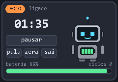
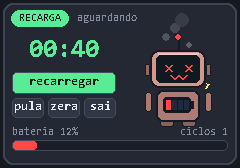
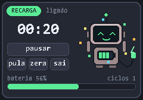
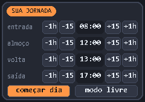
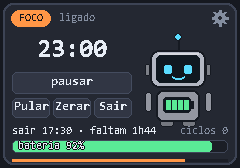
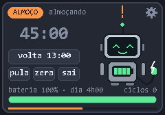

# Working Time Robo

Pomodoro flutuante em Python + Pygame com um robozinho: no **foco** a bateria
descarrega e ele esquenta (fumaça, faíscas, olhos vermelhos); na **recarga** ele
conecta o cabo e volta ao normal. A troca de fase é **manual**: quando o tempo
acaba, o robô espera você apertar o botão para começar a próxima fase.

| Foco | Fim do foco | Recarga |
|:---:|:---:|:---:|
|  |  |  |

## Como rodar

```bash
pip install -r requirements.txt
python main.py            # 25 min de foco / 5 min de recarga
python main.py --demo     # foco de 8 s e recarga de 60 s, sem jornada (para testar)
python main.py --opaque   # sem fundo transparente
```

Usa `pygame-ce` (o `pygame` clássico ainda não tem pacote para Python 3.14).

## Jornada de trabalho

Ao abrir, o app pergunta a sua jornada: **entrada, almoço, volta e saída**
(já preenchida com a da última vez). Com ela:

- o timer só roda **dentro do expediente** e **começa a contar sozinho** ao
  confirmar a jornada, ao iniciar o dia e ao voltar do almoço (as pausas de
  recarga continuam manuais);
- um foco **nunca passa do almoço** nem do fim do dia: se faltam 20 min para o
  almoço, o foco daquela vez dura 20 min;
- no almoço o robô fica carregando e o timer mostra quanto falta para a volta;
  ao voltar, ele comemora e começa um foco novo e descansado;
- no fim do expediente o timer para;
- o painel mostra quanto resta do dia e uma barra de progresso.

Para um horário exato (ex.: volta às 13:12), **clique no horário e digite**
(`1312`, `912` ou `9`) e aperte Enter; `Esc` cancela. Os botões -1h/-15/+15/+1h
continuam valendo para ajustes rápidos.

Prefere sem horários? Escolha **modo livre** e o timer funciona solto, como
antes. Dá para rever a jornada pela engrenagem → *jornada*.

| Jornada | Expediente | Almoço |
|:---:|:---:|:---:|
|  |  |  |

## Atividades na recarga

Ao começar a recarga, o painel abre um menu com **Alongar**, **Jogar forca** ou
**Só descansar**. O timer da recarga segue correndo por baixo, e tudo fecha
sozinho quando ela termina.

- **Alongar:** 7 exercícios guiados (pescoço, ombros, braços, punhos, costas,
  olhos e pernas). Os tempos se ajustam ao que resta da recarga e o robô faz o
  movimento na tela. *Próximo* pula um exercício e *Voltar* retorna ao menu.
- **Forca:** digite as letras no teclado; 6 erros e o boneco é enforcado. *Nova*
  troca a palavra. Uma partida em andamento é mantida se você voltar ao menu.
- `Esc` sai da atividade (e só fecha o app fora delas).
- Dá para desligar em engrenagem → *atividades na recarga: não*.

## Testar rápido com `--demo`

```bash
python main.py --demo
```

1. O foco de 8 s começa sozinho. Quando acabar (ou aperte **Pular**), clique em
   **recarregar**: o menu de atividades aparece.
2. Escolha **Alongar** (cada exercício dura ~9 s no demo) ou **Jogar forca**.
3. A recarga dura 60 s; ao fim, o menu fecha e o robô espera o próximo foco.

O demo não usa jornada nem grava `config.json`.

## Configuração

A engrenagem no canto do painel abre os tempos de **foco** e de **recarga**
(em minutos). Salvar grava em `config.json` e zera o timer atual.

## Controles

| Ação | Como |
|---|---|
| Iniciar / pausar / começar fase | clique no robô, botão principal, `ESPAÇO` ou `ENTER` |
| Mover a janela | arrastar |
| Pular fase | botão *Pular* ou `S` |
| Reiniciar | botão *Zerar*, `R` ou clique direito |
| Sair | botão *Sair* ou `ESC` |

A janela fica compacta (só robô e tempo, meio transparente) e se expande com o
mouse em cima. Transparência e "sempre no topo" funcionam só no Windows.

## Humores

| Bateria | Humor | Visual |
|---|---|---|
| ≥ 70% | fresco | olhos ciano, sorriso |
| 45–70% | trabalhando | olhos mais estreitos |
| 25–45% | quente | olhos âmbar, fumaça |
| < 25% | superaquecido | olhos em X vermelhos, fumaça e faíscas |
| recarga em andamento | carregando | olhos felizes verdes, cabo e raio |

## Estrutura

- `robot.py` — lógica pura (fases, bateria, humor), sem Pygame
- `activities.py` — rotina de alongamento e forca (lógica pura)
- `workday.py` — jornada: trechos do dia, cortes e contagens (também pura)
- `config.py` — leitura e gravação do `config.json`
- `painter.py` — desenho do robô por formas geométricas
- `winfx.py` — transparência, always-on-top e arrastar (Windows)
- `main.py` — janela, eventos e interface
- `tests/` — `python -m pytest`
